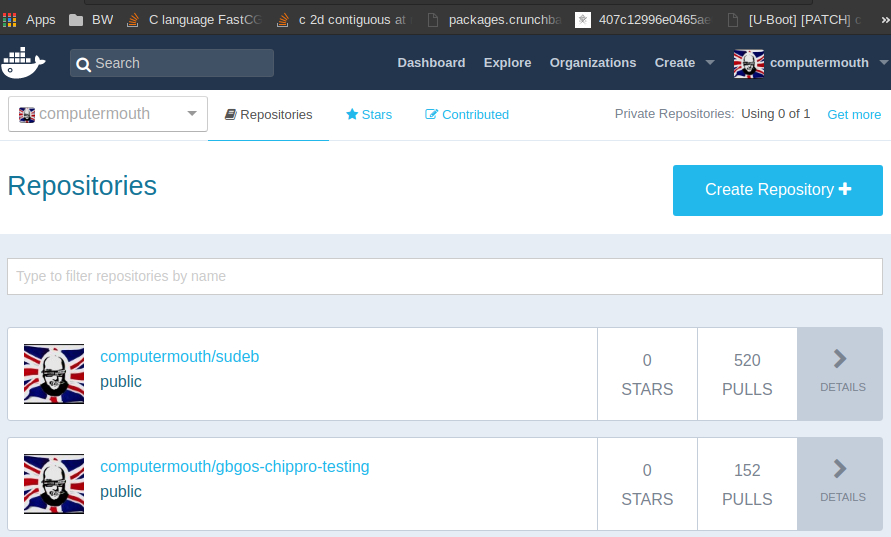
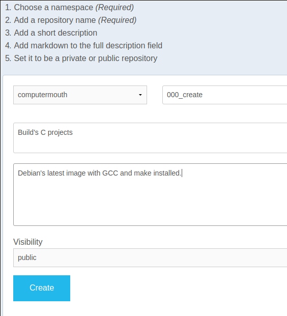
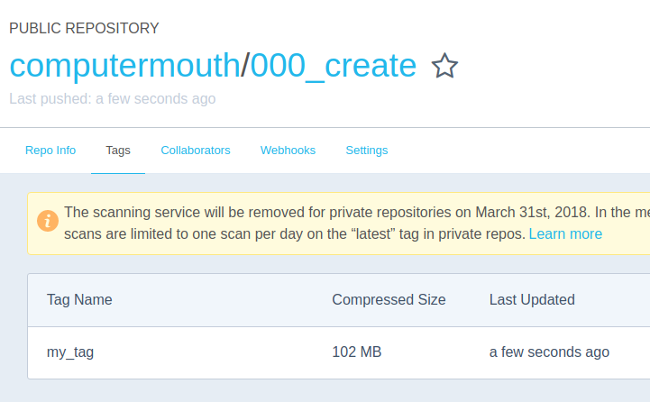

# Building with an image

In this demo, I'll use the previously created image to build a binary from sources that live outside of the image. You've still got the image from 000, right?

```
$ docker images
REPOSITORY          TAG                 IMAGE ID            CREATED             SIZE
000_create          latest              a94f1f09ec00        32 minutes ago      235MB
000_create          my_tag              a94f1f09ec00        32 minutes ago      235MB
debian              latest              2b98c9851a37        2 weeks ago         100MB
```

Have a quick look at the source here:
```
$ cat main.c 

#include <stdio.h>

int main(){
	printf("hello!\n");
	return 0;
}

$ cat Makefile 

all:
	gcc -o hello main.c

```

A simple hello world example in C, and a makefile to tell the compiler how to build it. Now we'll build with:

```
$ docker run -it --rm -v $(pwd):/build -w /build 000_create make
gcc -o hello main.c

$ ls
hello  main.c  Makefile  README.md
```

Here you'll notice two new flags. `-v` (volume) is essentially a mount. You must specify the directory to be used by the container, and the directory to mount to inside the container. This will result in a new top level directory called `/build` which will hold all the files in the current working directory.

Next is the `-w` flag, which specifies the directory in which your container session will start. Here, it's used so that we don't have to tell docker `cd /build && make`.

You can see that make calls the compiler to build the hello binary. The container immediately exits when the specified process returns. `ls` and you'll see the `hello` binary in your current directory! If you're on a Linux machine, feel free to run it. If you're not on Linux, we'll be running it in the next demo.

So now we have a tool which can build C projects. Now you can push it up to a registry and test out the distribution functionality. If you don't have access to a registry, you can create an account at [Docker Hub](https://hub.docker.com). From there, select `Create Repository`





Before you push, you'll need to rebuild the image with a new tag which includes your username, which should be nearly instant, again because of Docker's snapshotting capabilites.

```
$ cd ../000_create_an_image/

$ docker build -t computermouth/000_create:my_tag .

$ docker images
REPOSITORY                 TAG                 IMAGE ID            CREATED             SIZE
computermouth/000_create   my_tag              1c30c2dd7a3c        7 minutes ago       235MB
000_create                 latest              1c30c2dd7a3c        7 minutes ago       235MB
000_create                 my_tag              1c30c2dd7a3c        7 minutes ago       235MB
debian                     latest              2b98c9851a37        2 weeks ago         100MB
```

Now you're ready to push up your image! Log in with your docker credentials, and then perform the push:

```
$ docker login
Login with your Docker ID to push and pull images from Docker Hub. If you don't have a Docker ID, head over to https://hub.docker.com to create one.
Username: computermouth
Password: 
Login Succeeded

$ docker push computermouth/000_create:my_tag
The push refers to repository [docker.io/computermouth/000_create]
9013e941ad51: Pushed 
e1df5dc88d2c: Pushed 
my_tag: digest: sha256:8f520497603f2520c07c3ee3b5def625586cafe4383044d975b27918b285419e size: 741
```



Note that I've pushed up `my_tag` rather than `latest`.

Now let's delete the local copy of the image, and our artifact from the old builds:

```
$ docker images
REPOSITORY                 TAG                 IMAGE ID            CREATED             SIZE
computermouth/000_create   my_tag              a94f1f09ec00        About an hour ago   235MB
000_create                 latest              a94f1f09ec00        About an hour ago   235MB
000_create                 my_tag              a94f1f09ec00        About an hour ago   235MB
debian                     latest              2b98c9851a37        2 weeks ago         100MB

$ docker rmi computermouth/000_create:my_tag 000_create:latest 000_create:my_tag
Untagged: computermouth/000_create:my_tag
Untagged: 000_create:latest
Untagged: 000_create:my_tag
Deleted: sha256:e0b9977a402b0292ad2a46dbbd5cce6245fd7d9b7445c03f6b9917d7f9b80ab8
Deleted: sha256:b1aa12844cb647acca7693e91d49318e40b0279066357a762aa57652bdc032bb

$ docker images
REPOSITORY          TAG                 IMAGE ID            CREATED             SIZE
debian              latest              2b98c9851a37        2 weeks ago         100MB

$ cd ../001_build_with_an_image
$ rm -f ./hello
```

At this point, we can build the artifact using the image online. Feel free to try it with my image or with your own.

```
$ docker run -it --rm -v $(pwd):/build -w /build computermouth/000_create:my_tag make
Unable to find image 'computermouth/000_create:my_tag' locally
my_tag: Pulling from computermouth/000_create
c73ab1c6897b: Already exists 
80dfb43c15f3: Pull complete 
Digest: sha256:8f520497603f2520c07c3ee3b5def625586cafe4383044d975b27918b285419e
Status: Downloaded newer image for computermouth/000_create:my_tag
gcc -o hello main.c

$ ls
hello   Makefile main.c  README.md

$ ./hello 
hello!
```

The big takeaway here is that Docker makes it easy to distribute tooling. Using this method, developers can customize and easily share 100% exact copies of their development tooling.
